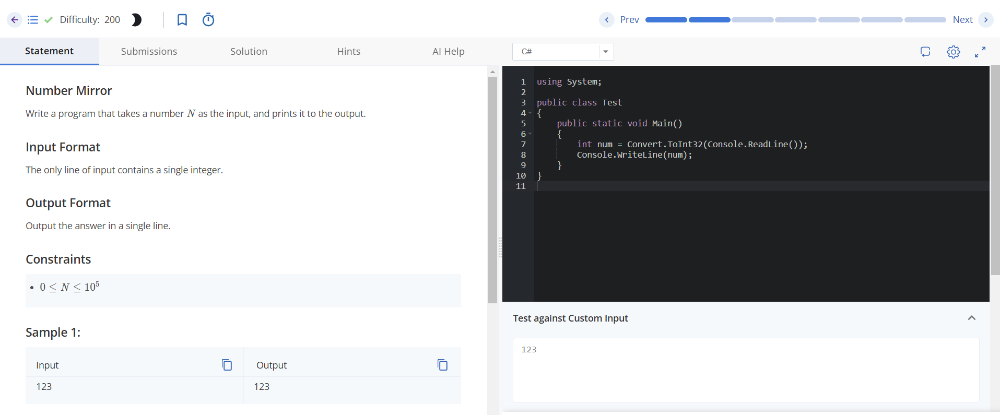
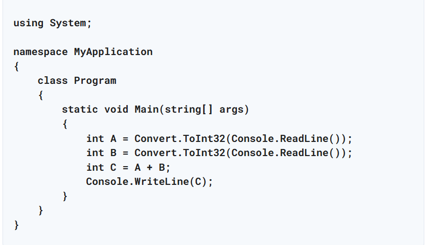

/* Structure of program 
    Namespace declaration 
    Class declaration amnd definitions 
    class memebers 
    Main method
    expressions and statements */


```
namespace ConsoleApp
{
    class Program
    {
        static void Main(string[] args)
        {
            Console.WriteLine("Hello world ");
            Console.ReadLine();
        }

    }
}

```



